# portfolio-website-PRD

# Product Requirements Document: Personal Portfolio Website

**Author:** Hannah
**Date:** 2026-07-23
**Version:** 1.0
**Status:** Draft — ready for build once placeholders below are filled in

---

## 1. Purpose & Scope

Build a personal portfolio website to showcase my work for job search purposes — the primary audience is hiring managers/recruiters. This is a solo project with no external stakeholders; this PRD exists to give an AI coding assistant an unambiguous, complete spec so the build can be done in as few correction passes as possible.

**In scope:** static, front-end-only portfolio site, deployed via GitHub Pages.
**Out of scope:** backend services, databases, user accounts, CMS, paid infrastructure.

---

## 2. Tech Stack & Constraints

| Item | Decision |
| --- | --- |
| Languages | Plain HTML, CSS, JavaScript only — **no frameworks, no build step, no npm dependencies** unless explicitly approved below |
| Hosting | GitHub Pages |
| Repo structure | Single repo, deployed from `main` branch (or `/docs` folder — decide and state which) |
| Package manager / bundler | None. If a specific JS library is needed (e.g. for an animation), it must be loaded via CDN `<script>` tag, not npm |
| Browser support | Latest 2 versions of major evergreen browsers (Chrome, Firefox, Safari, Edge) |
| Responsive breakpoints | Mobile: ≤480px · Tablet: ≤768px · Desktop: 1024px+ |
| Accessibility target | WCAG 2.1 AA |
| CSS units | Relative units, not fixed px, for anything that should scale with the user's root font-size/browser zoom: `rem` for font-sizes and the spacing scale, `em` for letter-spacing (relative to that element's own size, not the root — avoids a fixed px value going too tight/loose when an element's size changes across breakpoints). Fixed `px` stays fine for things that genuinely shouldn't scale with text zoom (shadow offsets, border widths, icon/grid dimensions). (Added after initial PRD — not yet reflected elsewhere except STYLE.md's per-section "Units in code" notes.) |

**Explicit instruction to the coding assistant:** Do not introduce a framework, bundler, CSS preprocessor, or package manager unless this document is updated to request it. If a task seems to need one, stop and ask rather than adding it.

---

## 3. Site Map / Pages

| Page/Section | Purpose | Notes |
| --- | --- | --- |
| Home | Hero intro + featured projects | [describe hero content/copy and which projects are “featured” once finalized]

Hero
Grid pattern (explained specs below) for the background. large heading copy featuring gradient (explained below). copy is layered a few times. once is 100% opacity, normal. then 100% opacity, hard light, 50 layer blur. followed by 80% opacity colour dodge, 50 layer blur. this is to give it a glowing and vibrant effect. 

Next is featured work, horizontal scrolling section to show off projects and give a brief overview of me professionally. 

Below is a headshot of me and a taster “about me” copy with a link to the about page.  |
| About | Bio + contact | This explains a bit about me professionally then moves into some personal fun facts and images so reader have a better understanding of me. 
The final section of the page is where the “contact” button in her header goes. Contact block (copy-email button + social links) lives at bottom of this page. |
| sexual-health-campaign | Project page | This is a project page walking though the steps of this project. It includes an media carousel, images and videos throughout.  |
| breastfeeding-guide | Project page | This is a project page walking though the steps of this project. It includes a vertical image carousel. |
| myhealthnb-launch | Project page | This is a project page walking though the steps of this project. It includes images and videos throughout.  |
| mental-health-campaign | Project page | This is a project page walking though the steps of this project. It includes images and videos throughout.  |
| [2+ more projects — TBD] | Project pages | Not ready yet; more may be added over time. Project pages should follow a consistent, repeatable HTML/CSS template so new ones can be added easily without rebuilding structure from scratch. |

**Note for build:** Since project pages will be added incrementally, structure each project page from a shared template (consistent header/nav, content layout, footer) rather than one-off markup, so adding a new project later is a copy-and-fill-in task.

This is a **multi-page site** (separate HTML pages, not a single scrolling page). Navigation should link between pages accordingly.

---

## 4. Content

Your copy and design are already finalized. Attach/paste them here rather than describing them, so the coding assistant builds from source content instead of improvising:

#### **Copy:**

- [index.html](https://app.notion.com/p/index-html-3a7c1667619d8025a0cbfb6840b0119c?pvs=21)
- [about.html](https://app.notion.com/p/about-html-3a7c1667619d80b2811ef3e039130bc4?pvs=21)
- [`sexual-health-campaign.html`](https://app.notion.com/p/sexual-health-campaign-html-3a7c1667619d815fa031fb3c1f326a1a?pvs=21) - links via `/assets/sexual-health-campaign/`
- [mental-health-campaign.html](https://app.notion.com/p/mental-health-campaign-html-3a7c1667619d814d9559d798f21133e1?pvs=21) - links via `/assets/mental-health-campaign/`
- [`breastfeeding-guide.html`](https://app.notion.com/p/breastfeeding-guide-html-3a7c1667619d81dabb72db7f0fd335cc?pvs=21) - links via `/assets/breastfeeding-guide/`
- [myhealthnb-launch.html](https://app.notion.com/p/myhealthnb-launch-html-3a7c1667619d8189bf2de0e6d64b43ce?pvs=21) - links via `/assets/myhealthnb-launch/`

#### **Design reference:**

- Home
    
    
    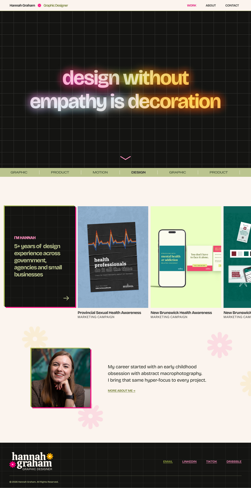
    
    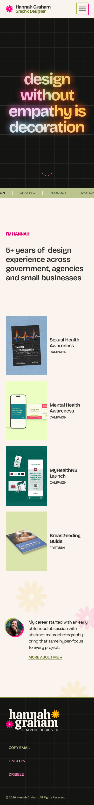
    
- About
    
    
    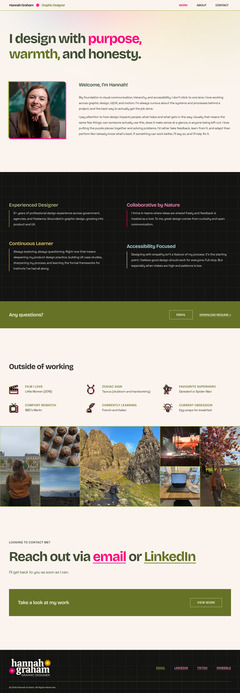
    
    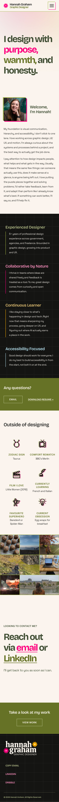
    
- sexual-health-campaign
    
    
    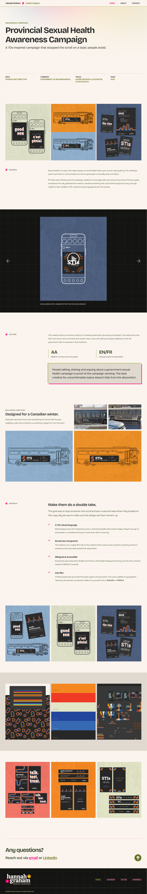
    
    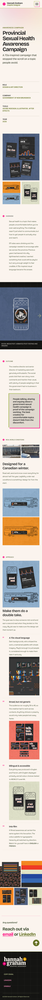
    
- mental-health-campaign
    
    
    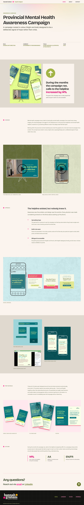
    
    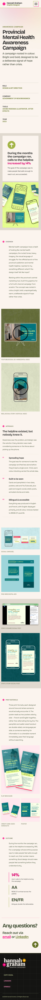
    
- breastfeeding-guide
    
    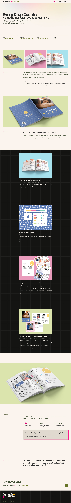
    
- myhealthnb-launch
    
    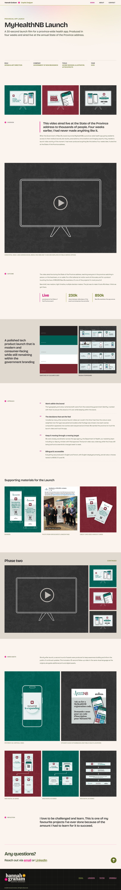
    

### **Fonts:**

| Use | Font |
|—|—|
| Headings/bold | Bricolage Grotesque Bold |
| Body/regular | Special Gothic Regular |


*(Note for build: both are Google Fonts — load via `<link>` tag from Google Fonts CDN, no npm/local font files needed unless you prefer self-hosting.)*

**Color palette:**

| Group | Name | Hex |
| --- | --- | --- |
| Primary | Green | `#A2B445` |
| Primary | Green Light | `#BBC48F` |
| Primary | Green Dark | `#667326` |
| Secondary | Pink | `#FF007F` |
| Secondary | Pink Light | `#FD8EBD` |
| Secondary | Pink Dark | `#C90064` |
| Tertiary | Yellow | `#FDAF04` |
| Tertiary | Yellow Light | `#E6C374` |
| Tertiary | Blue | `#B5DFED` |
| Neutral | Cream | `#FAF4ED` |
| Neutral | Sand | `#E0D9CF` |
| Neutral | Forest | `#3F4D33` |
| Neutral | Dark | `#2C2C2C` |

**Grid** - #ffffff 0.5px stroke, 30px grid at 10% opacity on #131412. This pattern is used regularly through the entire design. should get a nickname of some sort. 

This is used in the hero, footer, and other places.

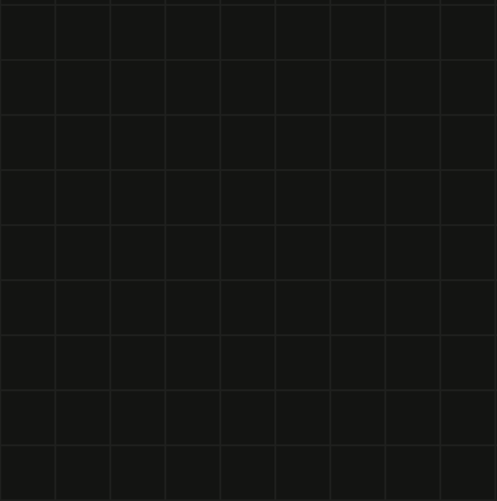

**Hero text gradient** - this is the gradient in the words of the hero banner on the home page. 


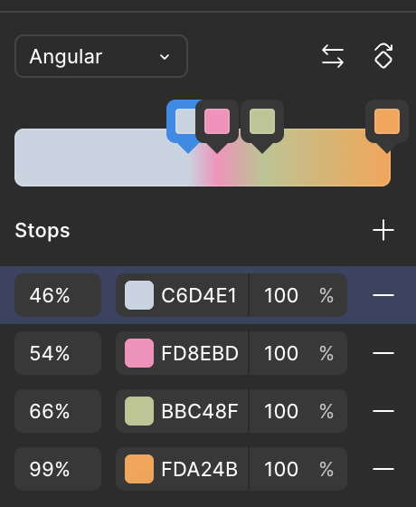

**Primary background gradient:**


primary background across website

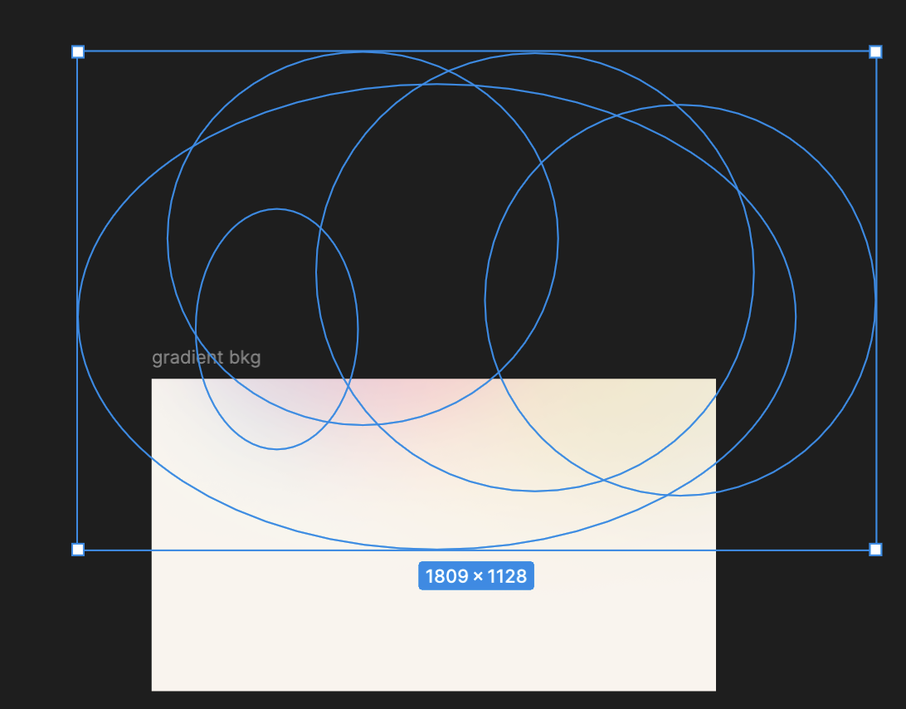

this is how it was built using blur and coloured circles. colours used with their opacities: pink 100%, #00E5FF 75%, yellow 60%, #BBC48F 96%, white 30%. overall gradient set to 50% opacity on top of #FAF4ED background. 

*(Note for build: define these as CSS custom properties, e.g. `--color-green: #A2B445;`, in a root/variables section of the stylesheet rather than hardcoding hex values throughout, so the palette stays consistent and easy to adjust.)*

**Assets:** See “Copy” section - each image used and its pathway link are in the copy docs.

**Explicit instruction:** Use only the content and layout provided here. Do not invent placeholder copy, stock imagery, or layout decisions not specified.

### **Components:**

**Header:**

Desktop


Mobile

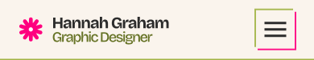

flower icon location: `/assets/global/flower-pink.svg`

burger menu location: `/assets/global/burger.svg`

**Footer:**

Desktop

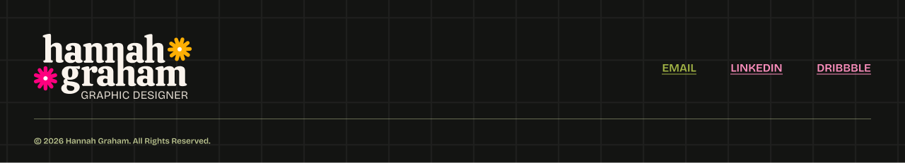

Mobile

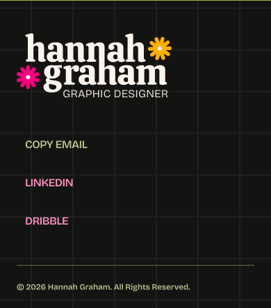

logo location: `/assets/global/logo-light.svg`

**Buttons:**

See below in interaction section

---

## 5. Functional Requirements

**Responsive layout** across mobile/tablet/desktop

**Navigation**: Sticky header (stays visible on scroll)
Hamburger menu on mobile (hamburger below the tablet breakpoint)

Built for minimum 390px width. Slides left from the right hand side, background darkens with `--color-dark` at 20% and blurs. 

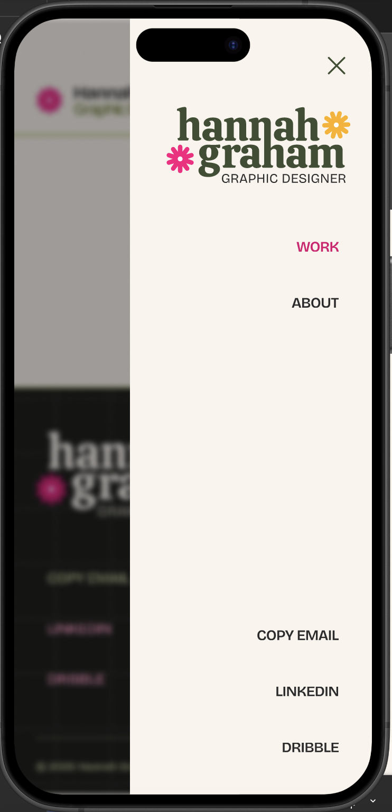

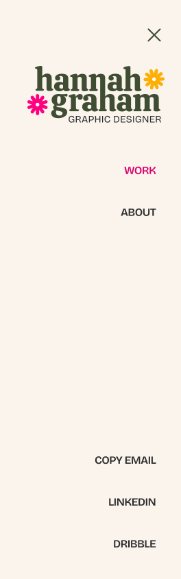


logo location: `/assets/global/logo-colour.svg`

#### Animations/interactivity:

- Custom cursor that highlights/reveals additional information or context on hover over: project thumbnails/cards, specific text/links, images, and interactive feedback states (e.g. confirming “email” button success). May extend to other elements as design develops — treat as an extensible interaction pattern, not a fixed list.
- Images and items that require hover context have “Hover-context” in the “copy” documents.

**Custom cursor:**

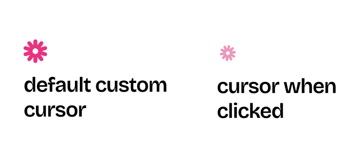

**Custom highlight effect:**

Highlight : `--color-pink-light` at 30% opacity

Text: `--color-pink`

ex.

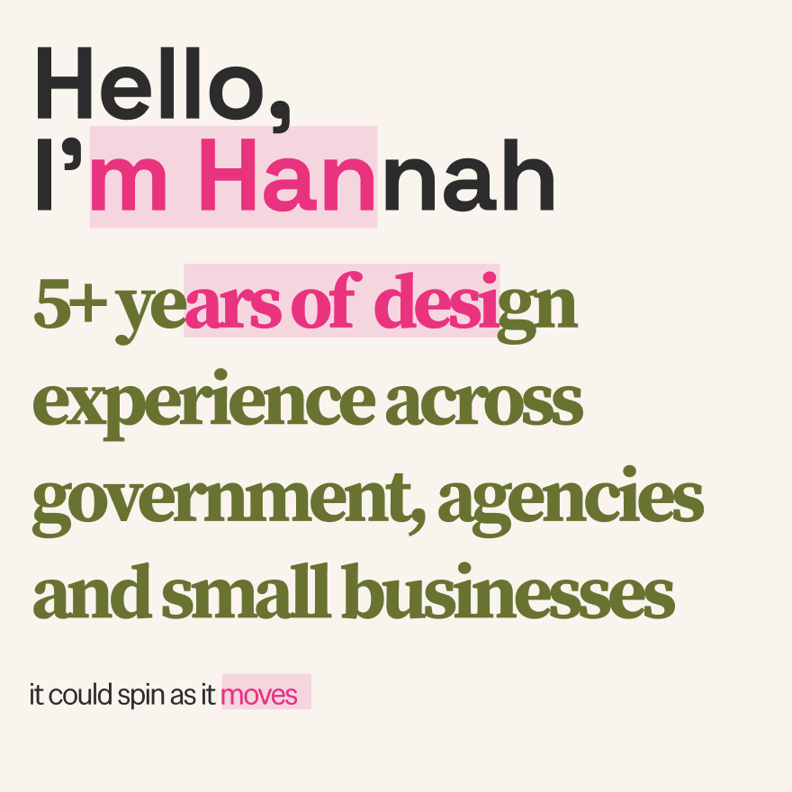

#### General hover effects on interactive elements

**Nav Links:**

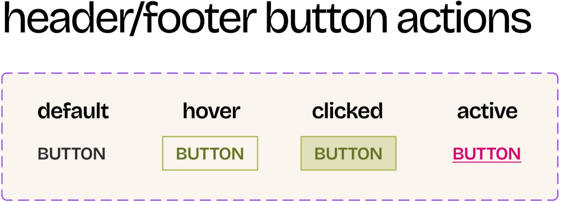

**Primary buttons:**

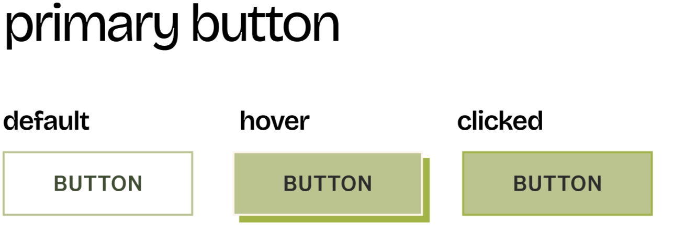

**Link buttons:** 

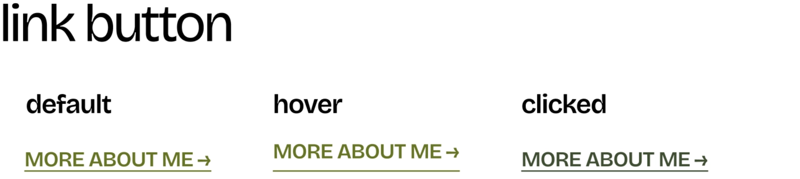

**Project Cards:**

Desktop

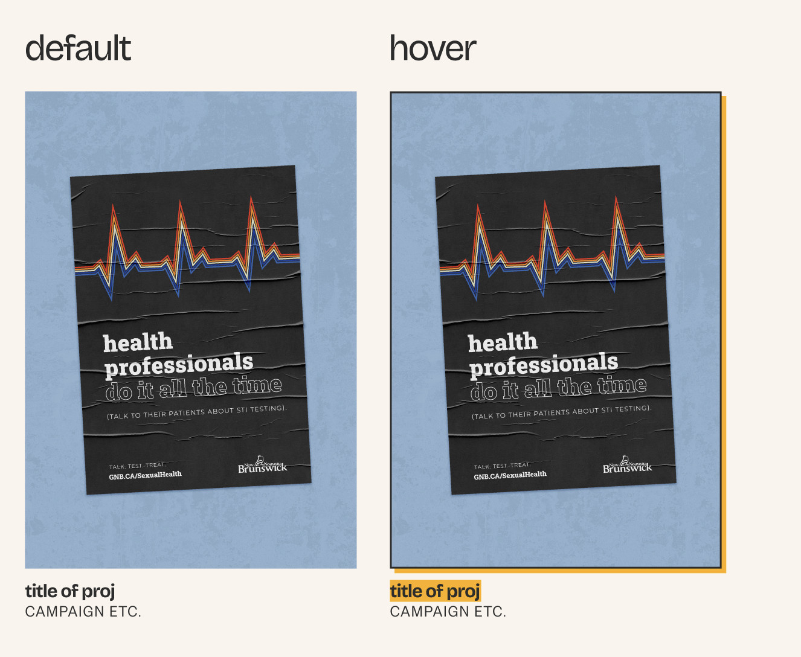

Mobile

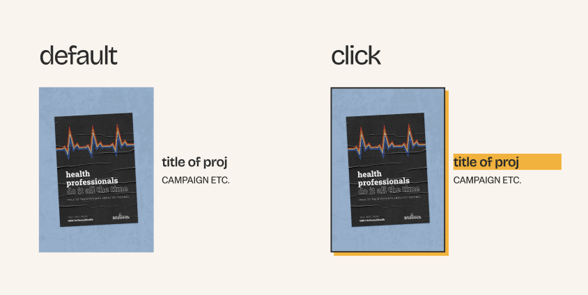

**Horizontal scrolling:** Home page, through the featured project cards. When used in desktop size mode, when sized down to mobile cards stack vertically and use vertical scrolling. Vertical scrolling for standard page flow elsewhere.

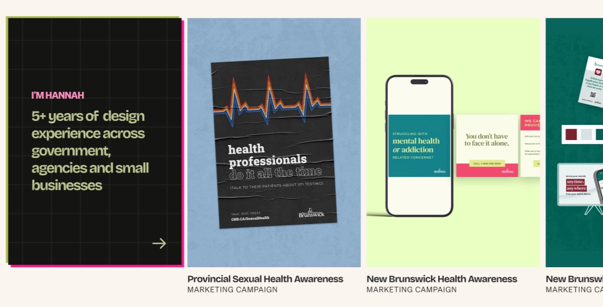

**Image carousels:** manual navigation only (arrows and/or swipe, no auto-advance) 

Image carousel - standard horizontal, arrow and swipe. 

Page: sexual-health-campaign.html

4 images

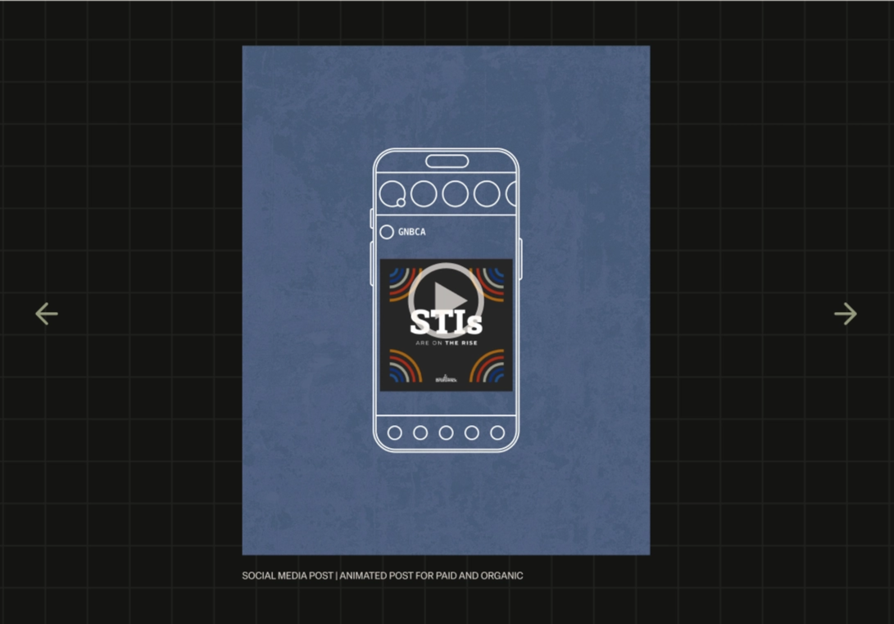

Image carousel - vertical swipe/scroll. this should fill the whole field of view. When user scrolls it should flip to next one until the “end” is reached. then carry ons scrolling as usual. (if this is a problem, make similar to the one above.) 

Page: breastfeeding-guide.html

4 images

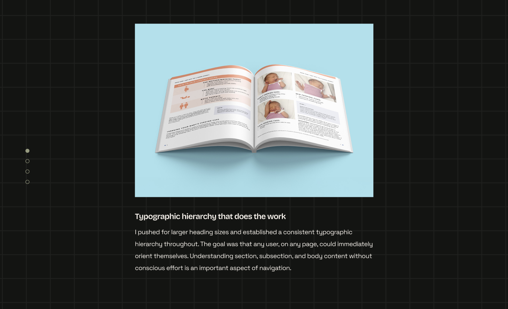

**Context Pop up**

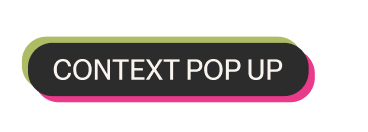

width: do not exceed 230px

corner rounding: 12px

drop shadows: 
green = x - 3, y -3. 90% opacity.
pink = x3, y 3. 90% opacity.

background: dark

text: light

*when hovering over item near the edge of the screen, ensure text does not move off screen to be unreadable. 

**Contact page:** Contact link should bring user to the bottom section of *About* page. 

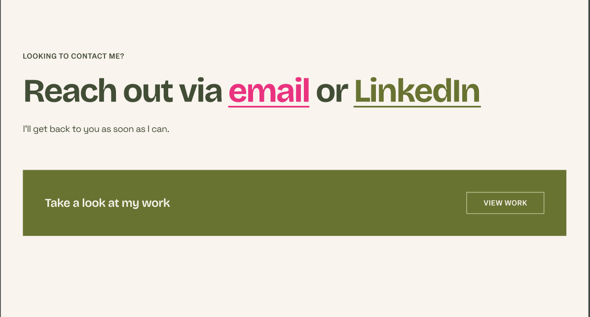

“email and “LinkedIn” are both links. 

“email” copies email address to clipboard, not a `mailto:` link — should give visual confirmation on click, e.g. “Copied!”


hover

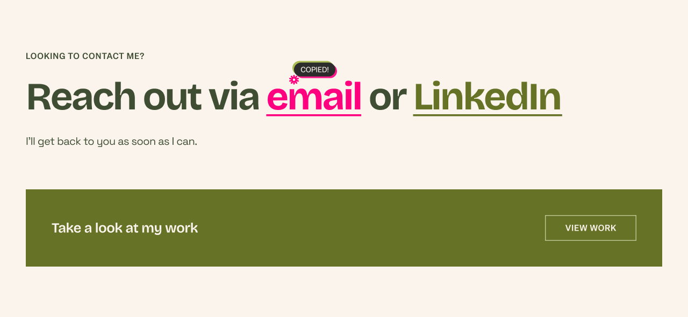

clicked

“LinkedIn” should show “open link” on hover and when clicked open a new tab and bring user to my linkedin page. 

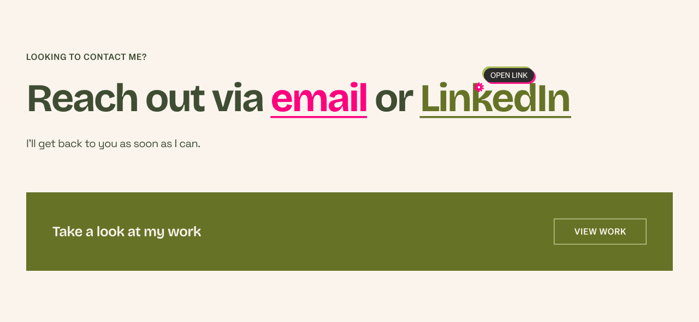

hover

”View work” button brings user back to the home page. hover should be the standard button hover. 

#### External links:

- Resume download button (downloads a PDF — confirm file location)
`/assets/hannahgraham-resume.pdf`
- Social media links - these should always open in a new tab.
linkedin: `https://www.linkedin.com/in/hannahgraham-one/`
dribbble: `https://dribbble.com/hannahgraham`
tiktok: `tiktok.com/@hannah.design`
- Per-project external content links (e.g. client-posted videos on YouTube/Facebook/etc.) — these will vary by project page, so should open in a new tab and be clearly styled as external links
    
    
    | **page** | **what** | **link** |
    | --- | --- | --- |
    | myhealthnb-launch.html | Launch video in English | [https://www.youtube.com/watch?v=t24kffS8QUI](https://www.youtube.com/watch?v=t24kffS8QUI) |
    | myhealthnb-launch.html | Linkedin photo credit for banners | [https://www.linkedin.com/posts/verosource-solutions_patientempowerment-digitalhealth-sotp2024-activity-7156463401177653248-G2cr?utm_source=share&utm_medium=member_desktop&rcm=ACoAADTCpu0BMbTya3V5FlzmCGRCBEFWteT_-UI](https://www.linkedin.com/posts/verosource-solutions_patientempowerment-digitalhealth-sotp2024-activity-7156463401177653248-G2cr?utm_source=share&utm_medium=member_desktop&rcm=ACoAADTCpu0BMbTya3V5FlzmCGRCBEFWteT_-UI) |
    | sexual-health-campaign.html | live action film for campaign - english | [http://youtube.com/watch?v=EP_WHidwXSY](http://youtube.com/watch?v=EP_WHidwXSY) |
    | sexual-health-campaign.html | live action film for campaign - french | [https://www.youtube.com/watch?v=wBsIrQxuzkg](https://www.youtube.com/watch?v=wBsIrQxuzkg) |

**Favicon and page `<title>`/meta tags set per page:**

Favicon for light mode: `/assets/global/favicon-colour.png` 
Favicon for dark mode: `/assets/global/favicon-white.png`

| Page | <Title> | SEO/meta description | **Open Graph tags** |
| --- | --- | --- | --- |
| `index.html` | Hannah Graham | Graphic Designer & UI/UX Designer | Graphic designer with 5+ years of experience in government, agency, and small business work, now branching into UI/UX and product design. | og:title: Hannah Graham | Graphic Designer
og:description: Design without empathy is decoration. Selected work in graphic design, UI/UX, and motion.
og:type: website |
| `about.html` | Meet Hannah Graham | Graphic & Product Designer | Learn more about Hannah Graham — a designer grounded in accessibility, collaboration, and continuous learning across graphic design and UX. | og:title: About Hannah Graham
og:description: I design with purpose, warmth, and honesty. Get to know the person behind the portfolio.
og:type: profile |
| `sexual-health-campaign.html` | Provincial Sexual Health Campaign | Hannah Graham | A 70s-inspired sexual health campaign for the Government of New Brunswick, designed to stop the scroll on a topic people usually avoid. | og:title: Provincial Sexual Health Awareness Campaign
og:description: Playful, retro-inspired creative that got people talking about a subject most campaigns play safe. Full case study inside.
og:type: article |
| `breastfeeding-guide.html` | Every Drop Counts: Breastfeeding Guide | Hannah Graham | A 50-page breastfeeding guide redesigned for the Government of New Brunswick, rebuilt around clear hierarchy for exhausted new parents. | og:title: Every Drop Counts: A Breastfeeding Guide for You and Your Family
og:description: A full redesign of a government resource guide, built for people who are tired, anxious, and need one answer fast. Print order doubled after launch.
og:type: article |
| `myhealthnb-launch.html` | MyHealthNB Launch Video | Hannah Graham | A 30-second motion graphics video for New Brunswick's province-wide health app, produced in four weeks and aired live at the State of the Province address. | og:title: MyHealthNB Launch
og:description: A province-wide health app launch, built frame by frame in After Effects and premiered at the State of the Province address. 230k views, 850k New Brunswickers served.
og:type: article |
| `mental-health-campaign.html` | Provincial Mental Health Campaign | Hannah Graham | A bold, colour-driven mental health awareness campaign for the Government of New Brunswick that helped drive a 14% rise in helpline calls. | og:title: Provincial Mental Health Awareness Campaign
og:description: Bright, bold, and built to feel like hope rather than crisis. See the full multi-channel campaign for New Brunswick's addiction and mental health helpline.
og:type: article |
| [2+ more projects — TBD] | [TBD] | [TBD] | [TBD] |
| [2+ more projects — TBD] | [TBD] | [TBD] | [TBD] |

## 6. Non-Functional Requirements

- **Performance:** page weight target [e.g. <1MB per page], optimized/compressed images
- **SEO:** meta description, Open Graph tags for link previews, semantic heading structure
- **Accessibility:** WCAG 2.1 AA — alt text on all images, sufficient color contrast, focus states visible on interactive elements
- **Analytics:** Google Analytics (GA4) snippet added to all pages
- **No console errors** on load

---

## 7. File/Folder Structure (for GitHub Pages)

```
/
├── index.html
├── /pages
│   └── about.html
│   └── project-one.html
│   └── 404.html
├── css/
│   └── style.css
├── js/
│   └── main.js
└── assets/
│   ├── global/                <-- Sitewide assets
│   │   ├── logo.svg
│   │   └── favicon.ico
│   ├── project-one/           <-- Project specific assets
│   │   ├── thumbnail.jpg
│   │   └── mockup.jpg
│   └── project-two/           <-- Project specific assets
│       ├── thumbnail.jpg
│       └── mockup.jpg
└── README.md

```

---

## 8. Deployment

- Repo name: `hannahgraham-portfolio`
- Custom domain: **Already set up** — `hannahgraham.ca`, DNS hosted via Porkbun (configured previously)
    - Confirm “Enforce HTTPS” is checked in repo Settings → Pages
- Deploy branch/folder: Root of `main` branch
- Any GitHub Pages settings that need to be configured (Settings → Pages → source)

---

## 9. Assumptions & Constraints

- No backend, no form submission handling (contact is a copy-email-to-clipboard button plus social links, no `mailto:`)
- Analytics: Google Analytics (GA4)
- Single contributor (you); no multi-branch workflow needed

---

## 10. Acceptance Criteria

The build is considered complete when:

- [ ]  All pages/sections from Section 3 are implemented with final content from Section 4
- [ ]  Site is fully responsive at defined breakpoints
- [ ]  All specified animations/interactions work as described
- [ ]  No build tools or dependencies were introduced beyond what’s listed in Section 2
- [ ]  Site loads correctly when served from GitHub Pages (not just localhost)
- [ ]  Passes a basic accessibility check (alt text, contrast, keyboard nav)

---

## 11. Build Order (suggested)

1. Static HTML structure for all pages, semantic markup, no styling
2. CSS: layout, typography, responsive breakpoints
3. Content: drop in final copy and assets
4. JS: interactivity/animations
5. Cross-browser/responsive QA
6. Deploy to GitHub Pages, verify live